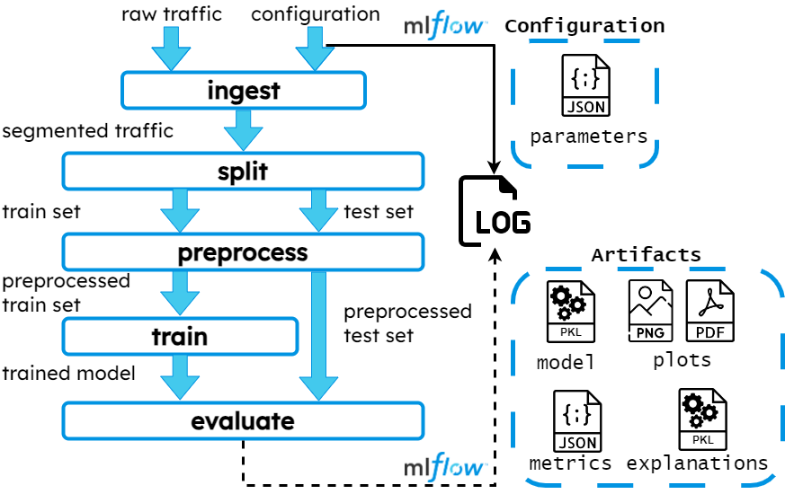

# MLOps Framework for Explainable Network Intrusion Detection with MLflow

Within our ongoing project, we've developed a comprehensive framework tailored for network traffic classification, with a primary focus on detecting and classifying traffic attacks and the ability to receive explanations for the outputs provided by the models.

A machine learning (ML) pipeline lifecycle is managed using [MLflow](https://mlflow.org/). The framework gives us the ability to organize experimental sessions into 'experiments', each represented by multiple 'runs', in each of which it is possible to train/load, test, and log a model.

### Pipeline



A ML pipeline is structured around five steps, inspired by MLflow, described as follows:

1. *Ingest* $-$ The initial phase of the pipeline involves data ingestion. Each dataset undergoes segmentation of raw traffic in PCAP format into traffic objects, which are then converted into Parquet format files. These files contain time series data for the relevant features of each traffic object. Additionally, the framework computes 16 statistics from the time series, including minimum, maximum, average, mean absolute deviation, kurtosis, skew, variance, and percentiles from the 10th to 90th with a step size of 10. The outcome is a CSV file that is passed on to the subsequent phase.

2. *Split* $-$ During the split phase, labeled data undergo partitioning into train and test sets. There are three main options for this partitioning, consisting in manually setting the proportions of data for each set using the split-portion parameter, utilizing K-fold validation by specifying the number of folds with the num-fold parameter and selecting a target fold with the target-fold parameter or optionally providing user-defined pre-split data to the pipeline. This split process generates training and testing sets, along with their corresponding ground-truth labels.

3. *Preprocess* $-$ This phase prepares the data for ML training by converting categorical labels into numerical representations through ordinal encoding. Additionally, it scales the features to fall within the range of [0, 1], based on samples from the training set. If the task being conducted is binary misuse detection or anomaly detection, all attack types are grouped together as a single malicious traffic class. Furthermore, a threshold value for the minimum number of samples per class (referred to as samples barrier) can be defined. Any class failing to meet this threshold is excluded from both training and evaluation.

4. *Train* $-$ During the training phase, users have the flexibility to train multiple models customized for their specific task.

5. *Test* $-$ During the evaluation phase, we evaluate the performance of models by testing them against a dedicated test set. This process results in the generation of various artifacts, including trained models, performance metrics, and reports or visualizations of results. Additionally, for improved interpretability, the framework optionally provides explanations for predictions using [SHAP](https://shap.readthedocs.io/en/latest/index.html), a widely used feature attribution technique. To guarantee that the saved model meets performance standards, the framework enables the setting of specific metric threshold


### Configure your experiments

To arrange a batch of experiments, one needs to manipulate and compile a specific JSON file 'exp_setup.json'. An example of compilation of it is shown below:


```
{
  "general-parameters": {
    "exp-name": "name_of_experiments",
    "tracking-uri": "tracking_server_IP",
    "random-state": [seed1, ...]
  },
  "ingest": {
    "dataset-list": ["dataset1", ...]
  },
  "split": {
    "split-portion": [train_ratio, val_ratio],
    "k-fold": true/false,
    "num-folds": number_of_folds
  },
  "preprocess": {
    "task": "bMD", "mMD" or "AD",
    "samples-barrier": min_class_samples
  },
  "train": {
    "algorithms": {
      "algorithm-name1": {
        "param1": ["value1", ...],
        ...
      },
      ...
    }
  },
  "evaluate": {
    "thresholds": {
      "param1": value1,
      ...
    },
    "explain": true/false
  }
}
```

Following the steps of the pipeline, the configuration parameters of the JSON are structured as follows:

1. *Ingest*: you have to specify the list of the datasets (viz. **"dataset-list"**) involved in the experimental session.

2. *Split*: you have to to determine the proportions (viz. **"split-portion"**) for dataset preparation, and whether to perform $k$-fold cross-validation (viz. **"k-fold"**, **"num-fold"**, **"target-fold"**).

3. *Preprocess*: there is an option for the preemptive data manipulation coherent with the task (viz. **"tasks"**) to perform, and a threshold value to consider exclude with insufficient samples (viz. **"samples-barrier"**).

4. *Train*: model can be chosen among available classifiers/detectors (viz. **"algorithms"**), each customizable with hyperparameters values for grid-search optimization of one or more models.

5. *Test*: it is possible to establish thresholds for performance metrics (viz. **"thresholds"**). Models that fail to meet these thresholds will not be registered. The user has the option to inspect explanation (viz. **"explain"**).

There is also a subset of fields which are common across steps (viz. **"exp-name"**, **"tracking-uri"**, **"random-state"**).


### Start the experimental campaign

Once you have set all the configuration parameters, you have to run the script via console:

```
python3 main_exps.py
```
